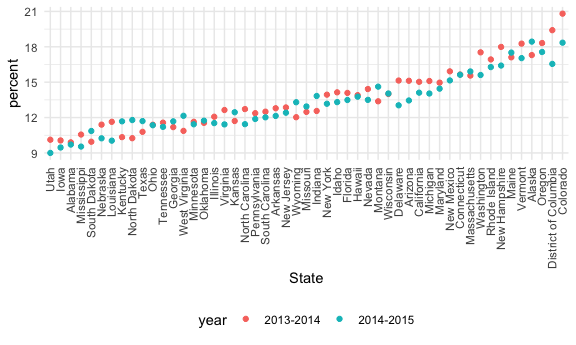

strings\_and\_factors
================
AnMei Chen
10/19/2021

``` r
library(tidyverse)
```

    ## ── Attaching packages ─────────────────────────────────────── tidyverse 1.3.1 ──

    ## ✓ ggplot2 3.3.5     ✓ purrr   0.3.4
    ## ✓ tibble  3.1.4     ✓ dplyr   1.0.7
    ## ✓ tidyr   1.1.3     ✓ stringr 1.4.0
    ## ✓ readr   2.0.1     ✓ forcats 0.5.1

    ## ── Conflicts ────────────────────────────────────────── tidyverse_conflicts() ──
    ## x dplyr::filter() masks stats::filter()
    ## x dplyr::lag()    masks stats::lag()

``` r
library(rvest)
```

    ## 
    ## Attaching package: 'rvest'

    ## The following object is masked from 'package:readr':
    ## 
    ##     guess_encoding

``` r
knitr::opts_chunk$set(
  fig.width = 6,
  fig.asp = .6,
  out.width = "90%"
)

theme_set(theme_minimal() + theme(legend.position = "bottom"))

options(
  ggplot2.continuous.colour = "viridis" , 
  ggplot2.continuous.fill = "viridis"
)

scale_color_discrete = scale_color_viridis_d
scale_fill_discrete = scale_fill_viridis_d
```

\#\#stings vectors

``` r
string_vec = c("my", "name", "is", "jeff")

# does something particular show up inside the string?
# strings are case sensitive
str_detect(string_vec, "jeff")
```

    ## [1] FALSE FALSE FALSE  TRUE

``` r
str_detect(string_vec, "m")
```

    ## [1]  TRUE  TRUE FALSE FALSE

``` r
str_replace(string_vec, "jeff","Jeff")
```

    ## [1] "my"   "name" "is"   "Jeff"

``` r
# to remove a word from the string
str_replace(string_vec, "is", "")
```

    ## [1] "my"   "name" ""     "jeff"

``` r
string_vec = c(
  "i think we all rule for participating",
  "i think i have been caught",
  "i think this will be quite fun actually",
  "it will be fun, i think"
  )

str_detect(string_vec, "i think")
```

    ## [1] TRUE TRUE TRUE TRUE

``` r
# the symbol ^ represents the beginning of the line
str_detect(string_vec, "^i think")
```

    ## [1]  TRUE  TRUE  TRUE FALSE

``` r
# the symbol $ represents the end of the line
str_detect(string_vec, "i think$")
```

    ## [1] FALSE FALSE FALSE  TRUE

``` r
string_vec = c(
  "Y'all remember Pres. HW Bush?",
  "I saw a green bush",
  "BBQ and Bushwalking at Molonglo Gorge",
  "BUSH -- LIVE IN CONCERT!!"
  )

str_detect(string_vec,"bush")
```

    ## [1] FALSE  TRUE FALSE FALSE

``` r
str_detect(string_vec,"Bush")
```

    ## [1]  TRUE FALSE  TRUE FALSE

``` r
# use [] to look for either this one or that one
str_detect(string_vec,"[Bb]ush")
```

    ## [1]  TRUE  TRUE  TRUE FALSE

``` r
string_vec = c(
  '7th inning stretch',
  '1st half soon to begin. Texas won the toss.',
  'she is 5 feet 4 inches tall',
  '3AM - cant sleep :('
  )

# look for a pattern at the beginning that have a number and followed with all upper letters and lower letters
#the [] speficies a range
str_detect(string_vec, "^[0-9][a-zA-Z]")
```

    ## [1]  TRUE  TRUE FALSE  TRUE

``` r
string_vec = c(
  'Its 7:11 in the evening',
  'want to go to 7-11?',
  'my flight is AA711',
  'NetBios: scanning ip 203.167.114.66'
  )

str_detect(string_vec, "711")
```

    ## [1] FALSE FALSE  TRUE FALSE

``` r
# look for 7 followed by anything and then follow by 11
# use . to represent anything
str_detect(string_vec, "7.11")
```

    ## [1]  TRUE  TRUE FALSE  TRUE

``` r
string_vec = c(
  'The CI is [2, 5]',
  ':-]',
  ':-[',
  'I found the answer on pages [6-7]'
  )

# to look for one side of the square bracket
# use \\ to indicates that the symbol you are looking for is not the special character in R
str_detect(string_vec, "\\[")
```

    ## [1]  TRUE FALSE  TRUE  TRUE

## why factors are weird

``` r
factor_vec = factor(c("male","male","female","female"))

as.numeric(factor_vec)
```

    ## [1] 2 2 1 1

``` r
# if you only speficified one factore, it will automatically move it to the front
factor_vec = fct_relevel(factor_vec, "male")
as.numeric(factor_vec)
```

    ## [1] 1 1 2 2

## NSDUH

``` r
nsduh_url = "http://samhda.s3-us-gov-west-1.amazonaws.com/s3fs-public/field-uploads/2k15StateFiles/NSDUHsaeShortTermCHG2015.htm"

table_marj = 
  read_html(nsduh_url) %>%
  html_table() %>% 
  first() %>% 
  slice(-1)
```

Lets clean this up! 1. select out everything that contains “P Value” 2.
change the table to a longer format 3. separate the age\_year column
into 2 columns : age and year 4. use mutate to get rid of the “)” of the
values 5. remove the “a”,“b”, and “c” at the end of the values of the
percent column 6. filter OUT (get rid of) all rows that has “Total
U.S.”, “Northeast”,“Midwest”,“South”, “West” in the State column

``` r
marj_df =
  table_marj %>% 
  select(-contains("P Value")) %>% 
  pivot_longer(
    -State,
    names_to = "age_year",
    values_to = "percent"
  ) %>% 
  separate(age_year, into = c("age","year"), "\\(") %>% 
  mutate(
    year = str_replace(year , "\\)", ""),
    percent = str_replace(percent, "[a-c]$",""),
    percent = as.numeric(percent)
  ) %>% 
  filter(!(State %in% c("Total U.S.", "Northeast","Midwest","South", "West")))

# we can also do this:
# separate(age_year, into = c("age","year"), -11) %>% 

#The %in% operator is used for matching values. “returns a vector of the positions of (first) matches of its first argument in its second”.
```

Do dataframe staff

``` r
marj_df %>% 
  filter(age == "12-17") %>% 
  mutate(
    State = fct_reorder(State, percent)
  ) %>% 
  ggplot(aes(x = State , y = percent, color = year)) +
  geom_point() +
  theme(axis.text.x = element_text(angle = 90, vjust = 0.5, hjust = 1))
```


